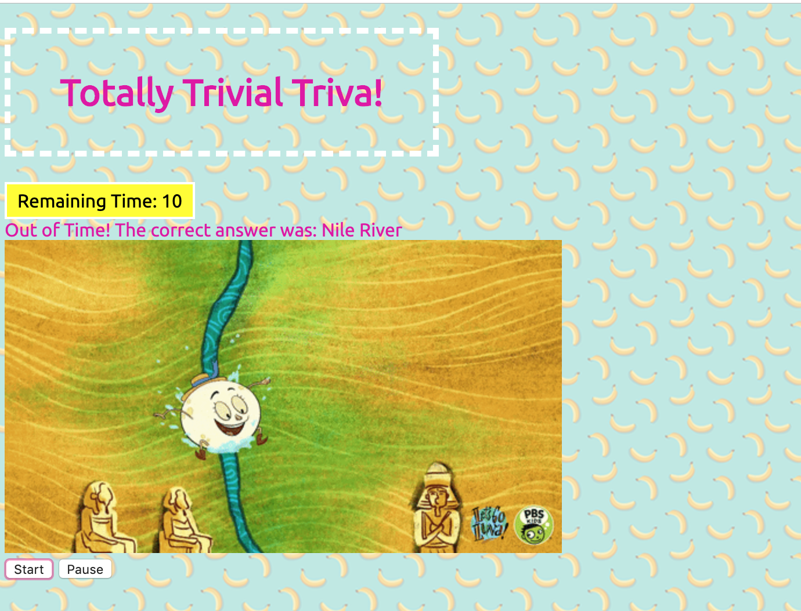

# TriviaGame

### Role & Contact Information 
Front-end Web Developer 

General inquiries at ddzhang2018@gmail.com.

### Description
Trivia Game is a game that shows only one question until the player answers it or their time runs out.If the player selects the correct answer, it will show a screen congratulating them for choosing the right option. After a few seconds, it will display the next question. The scenario is similar for wrong answers and time-outs.

### Technologies
- HTML5
- CSS
- JavaScript
 
### Link to TriviaGame 
https://dzhangcoder.github.io/TriviaGame/
